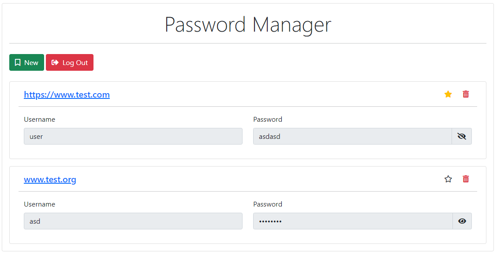

# Password Manager



A very basic password manager.<br>
**Tech stack:**
- PHP
- MySQL
- Bootstrap

## Setup
Download and install XAMPP.<br>
Clone this repository:
```sh
git clone https://github.com/0l1v3rr/password-manager.git
```
Start the **Apache** and the **MySQL** server in the control panel.<br>
Paste the `password-manager` folder into the `xampp/htdocs` folder.<br>
In the **phpmyadmin** panel, create the necessary database and the tables. The commands are in the `data/tables.sql` file.<br>
Go to `localhost/password-manager`, and enjoy!
